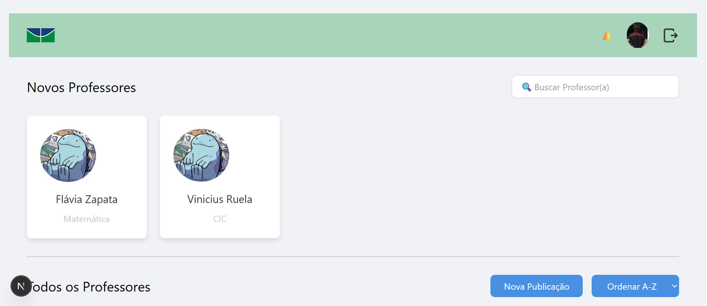

# Professors-Review - Plataforma de Avaliação de Professores


## 📖 Sobre o Projeto

O **Professors-Review** é uma plataforma web full-stack desenvolvida para permitir que alunos avaliem seus professores de forma anônima e construtiva. O sistema conta com um frontend moderno e reativo construído com Next.js e um backend robusto e escalável desenvolvido em Nest.js.

Este projeto foi criado como parte do processo seletivo para trainees da **CJR - Empresa Júnior de Computação da Universidade de Brasília (UnB)**. O objetivo era demonstrar habilidades em desenvolvimento web, integração de tecnologias e boas práticas de engenharia de software.

## ✨ Funcionalidades

* **Autenticação de Usuários:** Sistema seguro de cadastro e login para alunos.
* **Autorização:** Perfis de usuário para garantir que apenas alunos autenticados possam submeter avaliações.
* **Listagem de Professores:** Visualização de todos os professores cadastrados na plataforma.
* **Página de Avaliação:** Interface para submeter avaliações, com display de todos os Professores.
* **Visualização de Avaliações:** Os alunos podem ver as avaliações de cada professor.
* **Integração Completa:** Frontend e backend se comunicam de forma eficiente através de uma API RESTful.
* **Containerização:** O ambiente de desenvolvimento e produção é totalmente containerizado com Docker, garantindo consistência e facilidade no setup.

## 🚀 Tecnologias Utilizadas

O projeto foi construído utilizando um monorepo e as seguintes tecnologias:

* **Frontend:** [Next.js](https://nextjs.org/) (React Framework)
* **Backend:** [Nest.js](https://nestjs.com/) (Node.js Framework)
* **ORM:** [Prisma](https://www.prisma.io/)
* **Banco de Dados:** [SQLite](https://www.sqlite.org/index.html)
* **Containerização:** [Docker](https://www.docker.com/)

## ⚙️ Como Executar o Projeto

Para executar este projeto localmente, você precisará ter o [Docker](https://www.docker.com/get-started) e o [Docker Compose](https://docs.docker.com/compose/install/) instalados em sua máquina.

1.  **Clone o repositório:**
    ```bash
    git clone [https://github.com/seu-usuario/seu-repositorio.git](https://github.com/seu-usuario/seu-repositorio.git)
    cd seu-repositorio
    ```

2.  **Suba os containers:**
    O projeto é configurado para ser executado com um único comando. Na raiz do projeto, execute:
    ```bash
    docker-compose up --build
    ```

3.  **Acesse a aplicação:**
    * O **Frontend** estará disponível em: `http://localhost:3000`
    * O **Backend** estará disponível em: `http://localhost:3001`

O Prisma Studio também pode ser acessado para visualização e manipulação direta do banco de dados enquanto o container estiver rodando:
* **Prisma Studio:** `http://localhost:5555`

## 🙏 Agradecimentos

Este projeto foi desenvolvido com grande dedicação dos membros:
- **[Rafael](https://github.com/leitaonerd)**.
- **[Roberto](https://github.com/RobertorNeto)**.
- **[Adriano](https://github.com/Adrianowiedmann)**.
    
como um desafio para o **Processo Trainee da CJR (Empresa Júnior de Computação da UnB)**. Agradeço imensamente à CJR pela oportunidade de aprendizado e trabalho em equipe.

## 🖼️ Imagem de Referência Tela Inicial:



